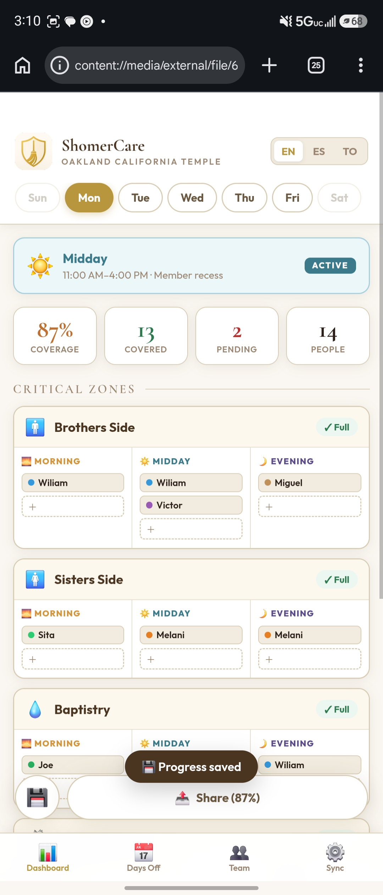
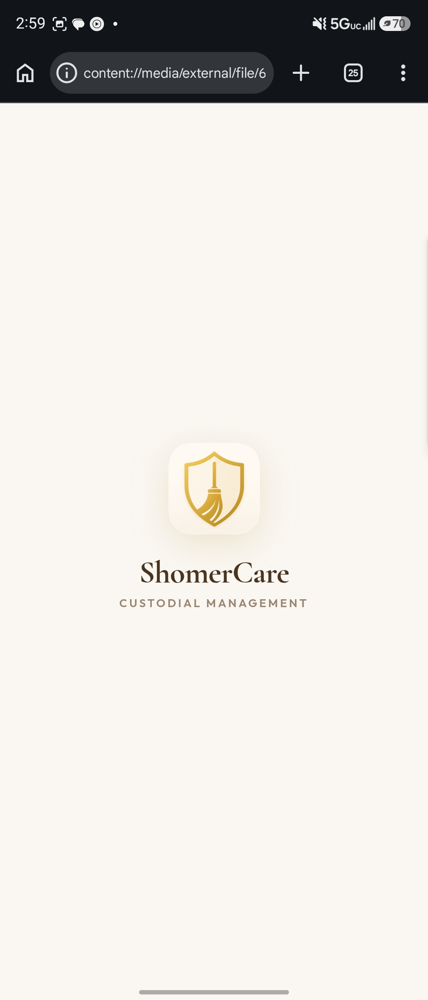
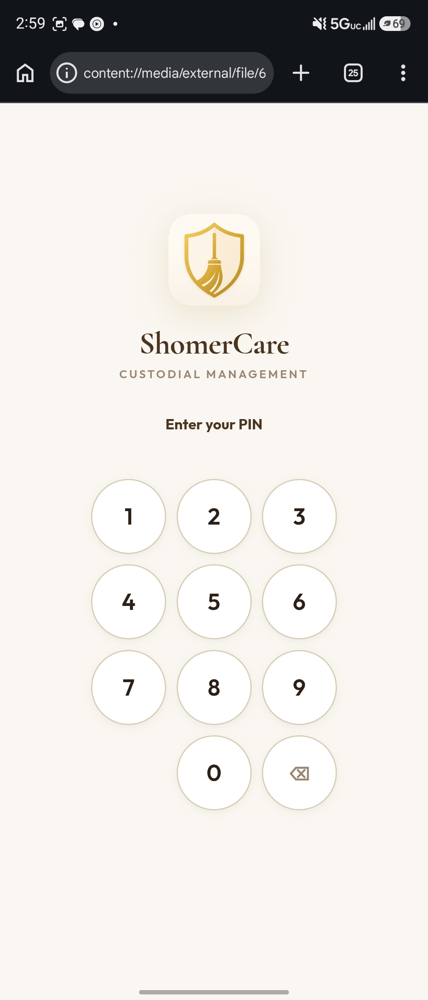
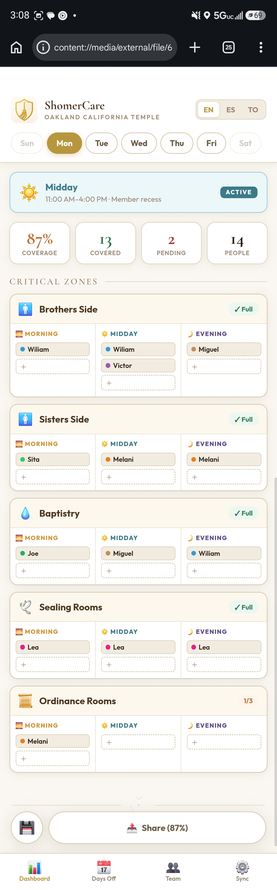
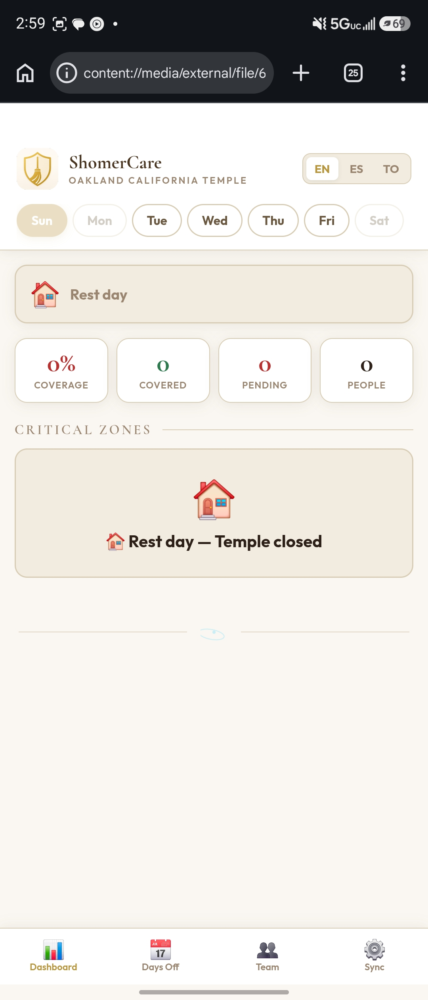
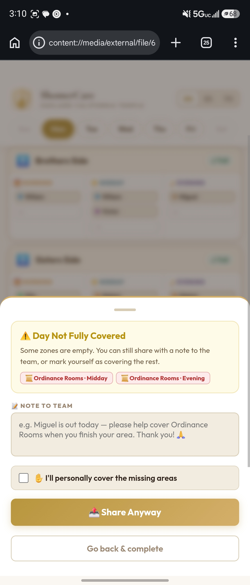

<div align="center">


# ShomerCare
### Custodial Zone Management System

**A secure, offline-first PWA for managing custodial teams, shift coverage, and zone assignments — built entirely in a single HTML file.**

[](shomercare-demo.html)
[](shomercare-demo.html)
[](shomercare-demo.html)
[](LICENSE)
[](https://claude.ai)

[🚀 Live Demo](#) · [📖 User Guide](#user-guide) · [🔐 Security](#security) · [📬 Contact](#contact)

---



</div>

---

## 🧩 The Problem It Solves

Managing a custodial team in a large facility is surprisingly complex. Supervisors face:

- **Coverage gaps** — not knowing which areas are uncovered until it's too late
- **Scheduling from memory** — no visual system to track who covers what, when
- **Day-off chaos** — when someone calls out, finding a replacement is manual and stressful
- **No communication tool** — schedules live on paper or in someone's head
- **Inflexible time windows** — different days have different available cleaning windows that must respect when the building is in use

ShomerCare was built specifically to solve all of this — in a single HTML file, with no server, no account, and no internet required.

---

## ✨ Features

### 🏛️ Zone Coverage Management
- **5 critical zones** with visual coverage tracking per zone per window
- **3 work windows per day** (Morning · Midday · Evening) — all times fully editable
- Real-time coverage percentage with color-coded status badges
- Visual alert when zones are uncovered

### 👥 Smart Team Profiles
- Full collaborator profiles with name, ID, WhatsApp, type (Full/Part)
- **Per-day, per-window schedule grid** — set exactly when each person works
- Zone primary assignments for smart replacement suggestions
- Supervisor private notes per person
- Color-coded team chips across the entire interface

### 📅 Days Off & Smart Replacements
- Add day-off dates with optional reason per collaborator
- Automatic red alert ⚠️ where the absent person was assigned
- **3-tier replacement system:**
  - 🟢 **Primary team** — zone teammates available this window
  - 🟡 **Available** — anyone else available
  - 🔴 **Outside regular hours** — triggers 5-second override warning
- Non-destructive: original assignment restored when person returns

### 💾 Save, Share & Print
- **Auto-save** on every change + manual save button
- **Share Day** — WhatsApp message with full day schedule + optional note
- **Share Week** — appears on Fridays when Mon–Fri are all complete
- Day notes included in WhatsApp and printed output
- Incomplete day sharing with override option and team note

### 🖨️ Print-Ready Weekly Schedule
- Professional print layout — one table per day
- Color-coded team legend
- Day notes and day-off alerts (⚠️ red) included
- Supervisor name and timestamp in footer

### 🌍 Trilingual Interface
- **English · Spanish · Tongan** — switch instantly from the header
- All UI elements, messages, WhatsApp content, and print output translate

### 🔄 Cross-Device Sync
- **QR Code** — generate on PC, scan on phone to load all data
- **JSON Export/Import** — send file via WhatsApp/email, import on any device
- 5-second countdown + explicit warning before any import (prevents accidental data loss)

### ⚙️ Fully Configurable
- Temple/facility name, supervisor info, photo
- Working days toggle (on/off per day)
- **Editable work windows** — change start/end times per day per window on the fly
- Reset to defaults option

### 🔐 PIN Lock System
- Secure 6-digit PIN required to access the app
- First-launch PIN registration flow with confirmation
- 3-attempt limit with auto-reset and developer contact info
- Change PIN from a hidden menu (3-tap secret access)
- Lock app button from within the Easter egg panel

### ⚛️ Easter Egg
- Hidden React atom ⚛️ at the bottom of the dashboard
- Tap to reveal developer info and app controls

---

## 🚀 Getting Started

**No installation. No server. No account.**

```bash
# 1. Clone the repo
git clone https://github.com/Victordaz07/shomercare.git

# 2. Open the file in any modern browser
open shomercare-demo.html
# or just double-click the file
```

> ✅ Works on Chrome, Safari, Firefox — mobile and desktop.

### First Launch
1. Create your 6-digit PIN when prompted
2. Go to **⚙️ Sync** → enter your facility name and supervisor info
3. Configure **Working Days** and adjust window times if needed
4. Go to **👥 Team** → tap each person to set their schedule and zones
5. Return to **📊 Dashboard** → start assigning zones

---

## 🏗️ Architecture

```
shomercare.html          ← entire application (single file)
│
├── CSS (~500 lines)     CSS variables, responsive layout, animations
├── HTML (~800 lines)    Views, modals, lock screen, nav
└── JavaScript           
    ├── Translations     EN / ES / TO dictionary
    ├── Data Layer       localStorage with validation & sanitization  
    ├── PIN System       Registration, unlock, change PIN, master key
    ├── Dashboard        Zone rendering, coverage calculation, FAB
    ├── Team Profiles    Rich profiles with schedule grid
    ├── Days Off         Date management, replacement suggestions
    ├── Sync             QR generation, JSON export/import
    ├── Print            Weekly schedule builder
    ├── Share            WhatsApp message builder
    └── Guide            In-app tutorial (accordion)
```

**No dependencies.** No npm. No build step. No framework.  
One file. Open it. Done.

---

## 🔐 Security

ShomerCare handles sensitive personnel and scheduling data. Multiple layers of protection:

| Layer | Implementation |
|---|---|
| **Local-only storage** | All data stays on device — nothing sent to any server |
| **Content Security Policy** | `<meta>` CSP header blocks unauthorized scripts |
| **Input sanitization** | All user inputs stripped of HTML tags before storage |
| **Import validation** | JSON imports fully validated and sanitized before loading |
| **Photo validation** | Image uploads validated by type and size (2MB max) |
| **PIN lock** | 6-digit PIN required to access the app |
| **Destructive action countdowns** | 5-second forced delay on imports and overrides |
| **No-referrer policy** | Prevents data leakage when navigating to external URLs |

> ⚠️ **Note:** This is a client-side application. Data is stored in `localStorage`. Keep your device locked when not in use.

---

## 📁 Repo Structure

```
shomercare-demo/
├── shomercare-demo.html   ← Public demo (generic team, no master key)
├── assets/                ← Screenshots and media
│   └── dashboard-preview.jpg
├── README.md
└── LICENSE
```

> The production version (with real team data) is maintained in a private repository.

---

## 🖥️ Screenshots

<table>
  <tr>
    <td align="center"><b>Splash Screen</b></td>
    <td align="center"><b>PIN Lock</b></td>
    <td align="center"><b>Dashboard — Active</b></td>
  </tr>
  <tr>
    <td></td>
    <td></td>
    <td></td>
  </tr>
  <tr>
    <td align="center"><b>Rest Day View</b></td>
    <td align="center"><b>Coverage Alert & Share</b></td>
    <td align="center"><b>Zone Assignment</b></td>
  </tr>
  <tr>
    <td></td>
    <td></td>
    <td></td>
  </tr>
  <tr>
    <td align="center"><b>Team Profiles</b></td>
    <td align="center"><b>Days Off</b></td>
    <td align="center"><b>Sync / QR Code</b></td>
  </tr>
  <tr>
    <td></td>
    <td></td>
    <td></td>
  </tr>
</table>

---

## 💡 Design Philosophy

> *"Everything a supervisor needs. Nothing they don't."*

ShomerCare was designed as a **vibe coding experiment** — starting from a basic Excel scheduling problem and evolving into a full-featured management system through iterative conversation with Claude AI.

Key decisions:
- **Single HTML file** — zero friction deployment, works offline, easy to share
- **No framework** — vanilla JS is fast, transparent, and requires no build tools
- **Mobile-first** — designed for a supervisor's phone, not a desktop workstation
- **Elegant aesthetic** — cream/gold palette inspired by the facility's sacred character
- **Trilingual** — serves diverse custodial teams natively

---

## 🛠️ Customization

ShomerCare is designed to be adapted for any facility with custodial zones:

1. **Rename zones** — edit the `ZIDS` and `ZONE_ICONS` arrays and translation strings
2. **Add/remove work windows** — edit `appSettings.windows` defaults
3. **Change language** — add entries to the `T` translation object
4. **Rebrand** — update app name, icon, and color variables in `:root`

---

## 📬 Contact

**Victor Ruiz** — Frontend Developer & Vibe Coder

[](https://github.com/Victordaz07)
[](mailto:viruizbc@gmail.com)
[](https://instagram.com/alfonsorb07)
[](https://portarts.dev)

> Available for custom development, feature additions, and improvements on request.

---

## 📄 License

MIT License — see [LICENSE](LICENSE) for details.

---

<div align="center">

**Built with ❤️ and Claude AI · ShomerCare v1.0 · 2026**

*"Shomer" (שׁוֹמֵר) — Hebrew for Guardian, Protector, Keeper*

⚛️

</div>
