<div align="center">

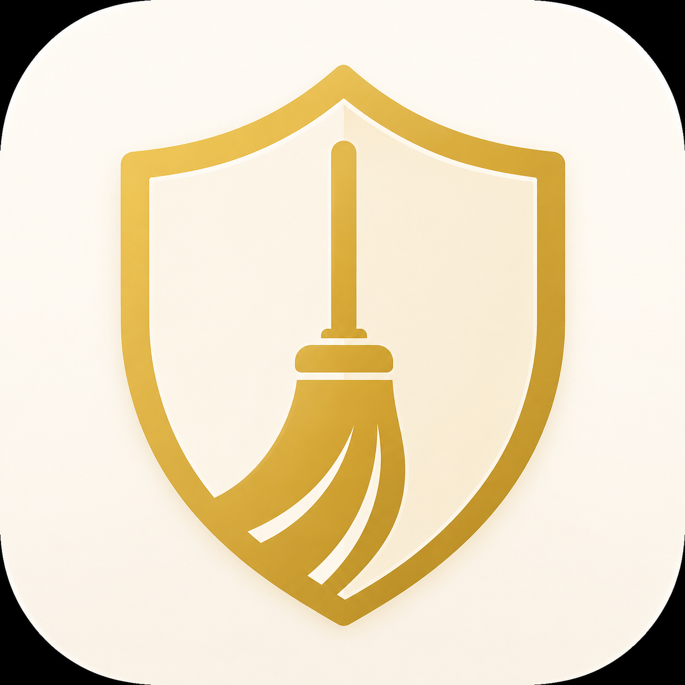

# ShomerCare

**A lightweight, offline-first scheduling and communication tool for custodial teams, facility supervisors, and any operations team that needs to coordinate people across zones and time windows.**

One HTML file. No installation. No server. No subscription. Works on any device.

[](shomercare-demo.html)
[](shomercare-demo.html)
[](shomercare-demo.html)
[](LICENSE)
[](https://claude.ai)

---

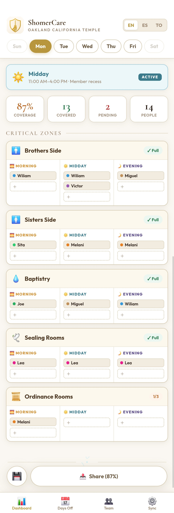

</div>

---

## What it is

ShomerCare is a single-file web application designed to solve a common operational problem: coordinating teams across multiple work zones and time windows. It was originally built for temple custodial operations but is fully generic — any organization with zones (areas, sectors, floors, rooms) and shifts (morning, midday, evening, or custom) can use it.

It runs entirely in the browser. There is no backend, no database, no cloud sync. All data stays on the device. To move data between devices, you use either a JSON export file or a QR code.

---

## Why it exists

Coordinating a custodial or operations team typically involves:

- Multiple people working different zones at different times
- Frequent schedule changes, sick days, and replacements
- The need to communicate daily assignments to each team member
- A supervisor or lead who tracks coverage gaps in real time

Most teams handle this with a mix of spreadsheets, group texts, paper schedules, and verbal coordination. ShomerCare consolidates all of that into one tool that works on any phone or computer, with or without internet.

---

## Key Features

### 📊 Core Scheduling

<div align="center">
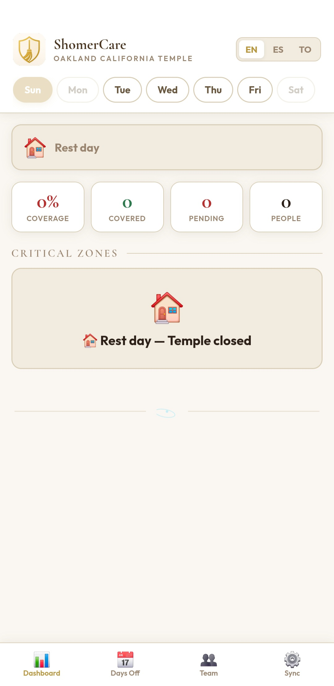 &nbsp; 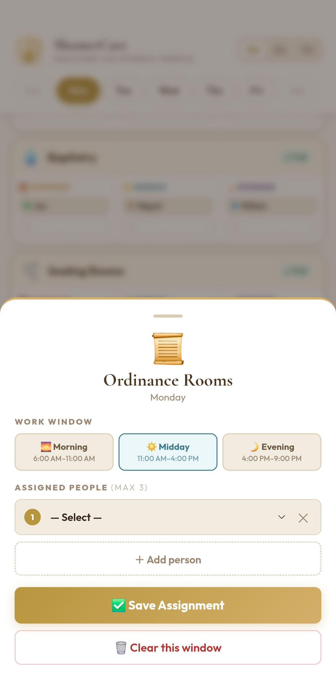
</div>

- **Daily dashboard** showing all zones and time windows at a glance
- **Coverage indicators** that flag uncovered windows immediately
- **Tap-to-assign** — tap a window, pick a person, done
- Day-off tracking with automatic warning when an assigned person is off
- Suggested replacements drawn from team members trained in the same zone

---

### 👥 Team Management

<div align="center">
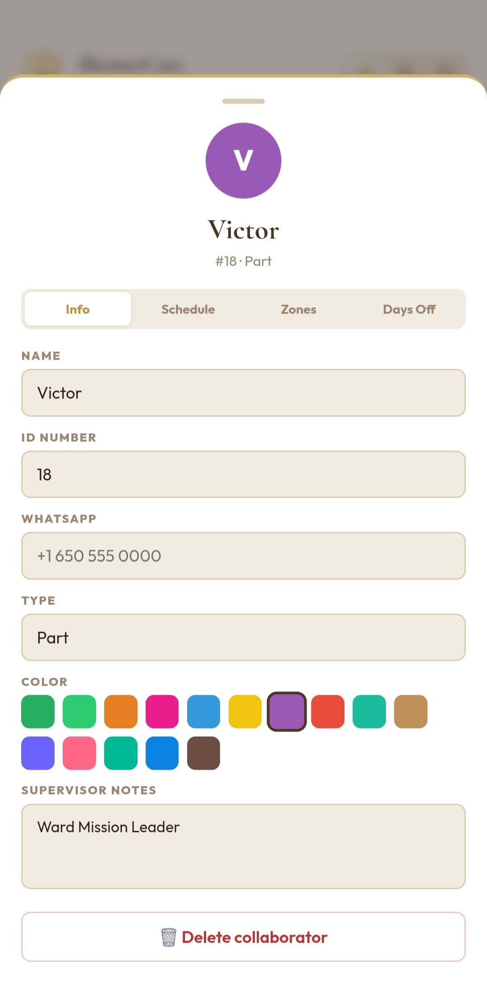 &nbsp; 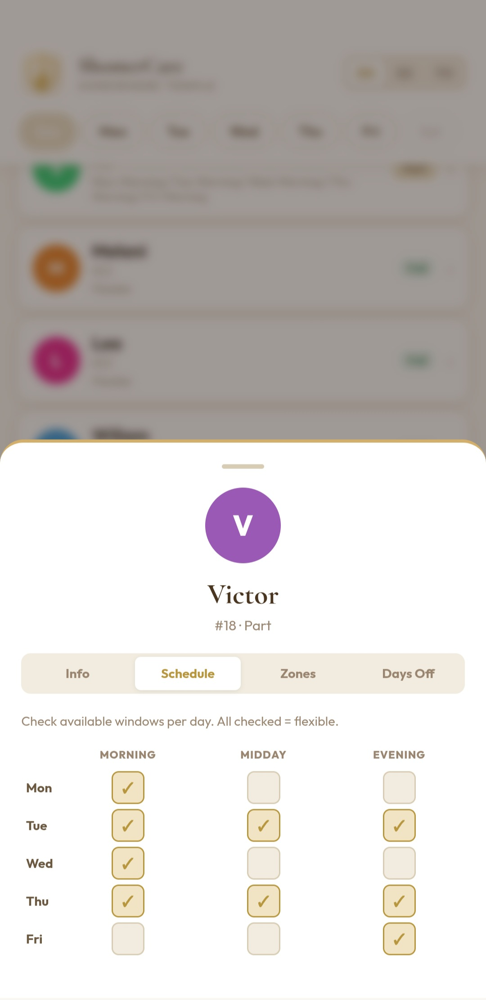 &nbsp; 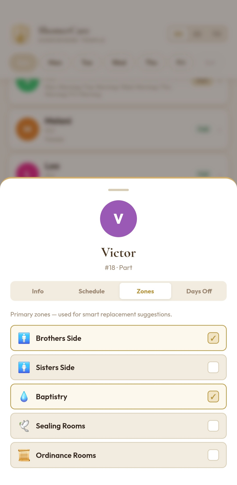
</div>

- Configurable team with profile info (name, ID, phone, type, color, supervisor notes)
- **Per-person schedule preferences** — which windows on which days
- Zone trainings — who can cover which zones
- Days off with reasons and date ranges

---

### 📅 Days Off & Smart Replacements

<div align="center">
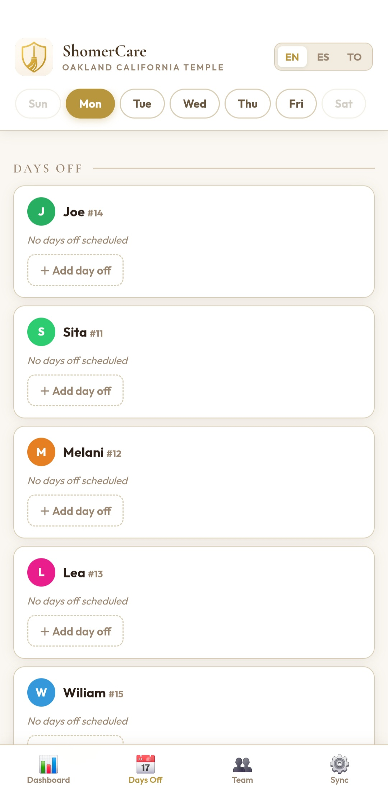 &nbsp; 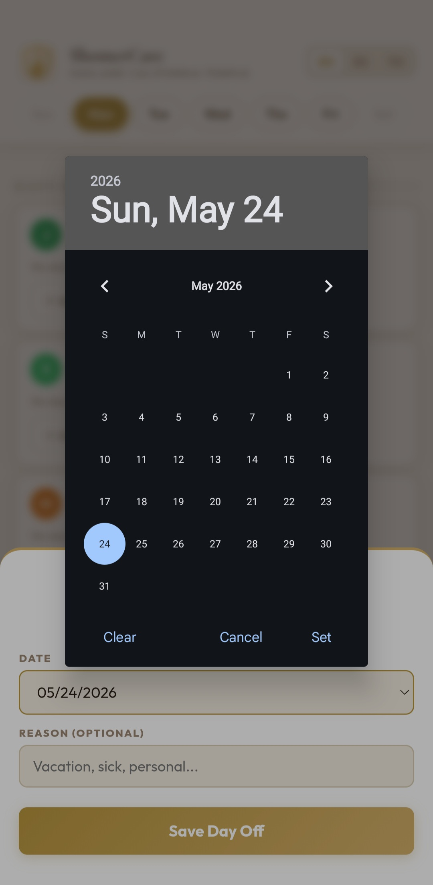 &nbsp; 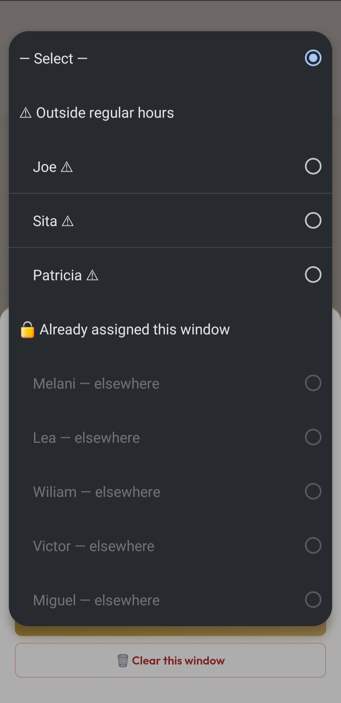
</div>

- Add day-off dates with optional reason per collaborator
- Automatic ⚠️ alert where the absent person was assigned
- **3-tier replacement picker:**
  - 🟢 Primary team — zone teammates available this window
  - 🟡 Available — anyone else with open availability
  - 🔴 Outside regular hours — triggers a 5-second override warning
- Non-destructive: original assignment restored when person returns

---

### 💬 Communication & Sharing

<div align="center">
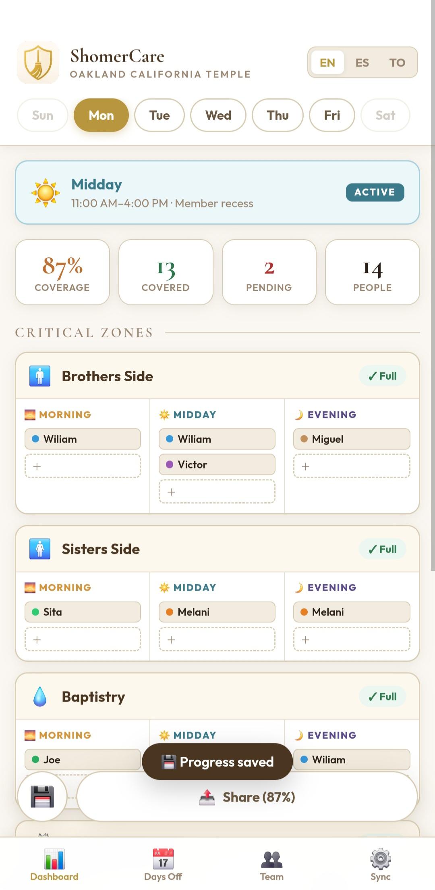 &nbsp; 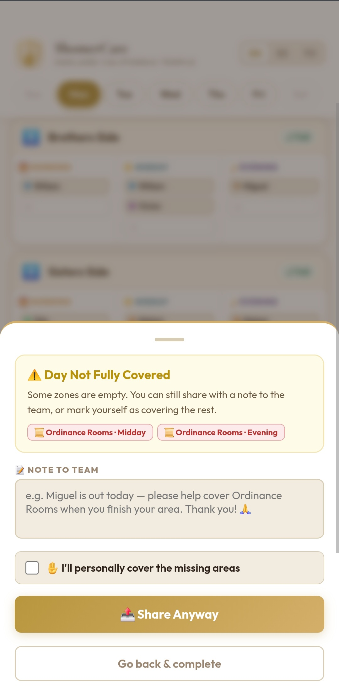
</div>

- **WhatsApp message generation** — one tap to send today's assignments to each person
- Personalized messages with each person's specific schedule for the day
- Bulk day messages summarizing all assignments and coverage gaps
- **Share Week** — appears on Fridays when Mon–Fri are all complete
- Incomplete day sharing with override option and team note

---

### ⚙️ Organization Customization

<div align="center">
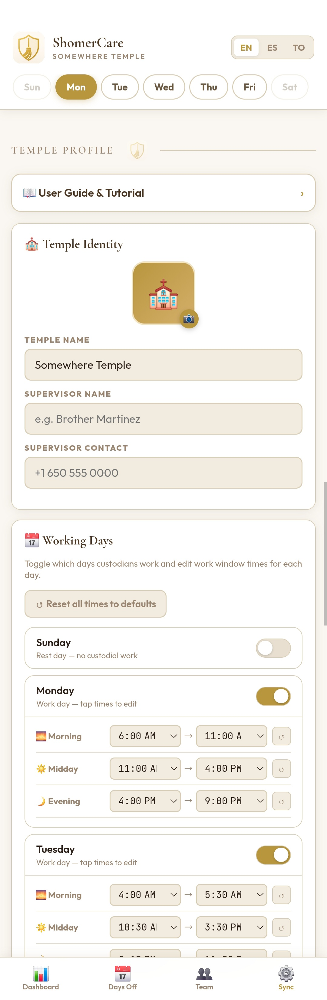
</div>

- **Configurable organization identity** — name, icon (8 presets: temples, offices, hospitals, factories, schools, hotels, institutions, stores), photo
- **Custom zone groups** — define your own groups (e.g., "Primary", "Support", "Floor 1", "Floor 2") with editable names
- **Custom zones** within each group, each with its own icon, name, and time-window overrides
- **Reorderable zones and groups** via up/down arrows
- **Configurable work windows** per day with custom hours
- **Work day toggles** — which days of the week the team operates

---

### 🔄 Cross-Device Sync

<div align="center">
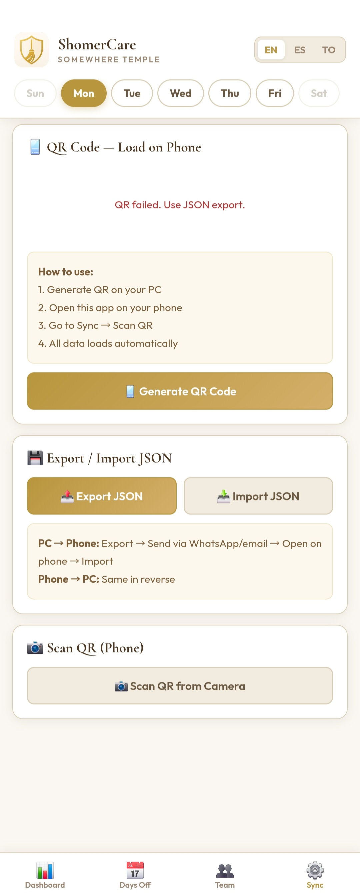
</div>

- **Full JSON export/import** — includes everything (team, assignments, photo, notes, settings)
- **Smart QR sync** — lightweight QR with only volatile fields (assignments, days off, schedules) for daily PC → phone updates
- **Diff-based merge** — when scanning a QR, the phone preserves heavy fields (photos, supervisor notes) that aren't in the QR
- **Heavy-field detection** — warns when photos or notes have changed and a full JSON sync is needed

---

### 🌍 Multilingual

- Full UI translation: **English · Spanish · Tongan**
- Persists across sessions
- All generated WhatsApp messages and print output adapt to the selected language

---

### 🔐 PIN Lock

<div align="center">
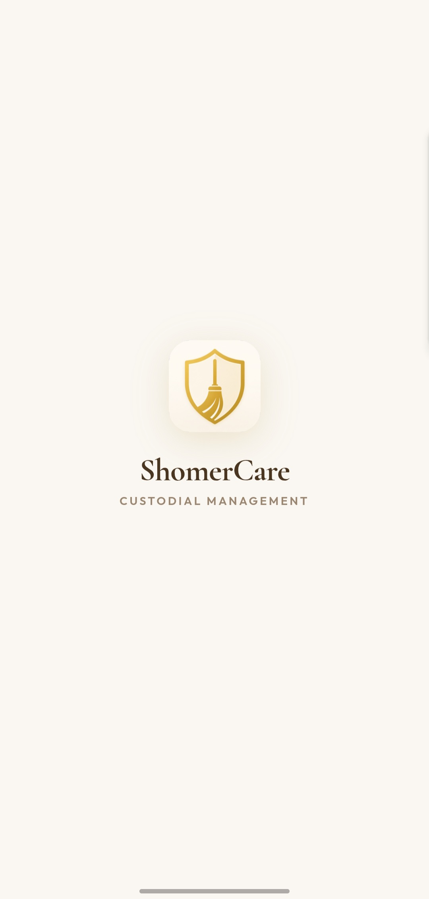 &nbsp; 
</div>

- 6-digit PIN required to access the app
- First-launch registration flow with confirmation
- 3-attempt limit with auto-reset
- Change PIN from a hidden menu (3-tap secret access)
- No telemetry, no analytics, no external requests

---

### 📖 In-App User Guide

<div align="center">
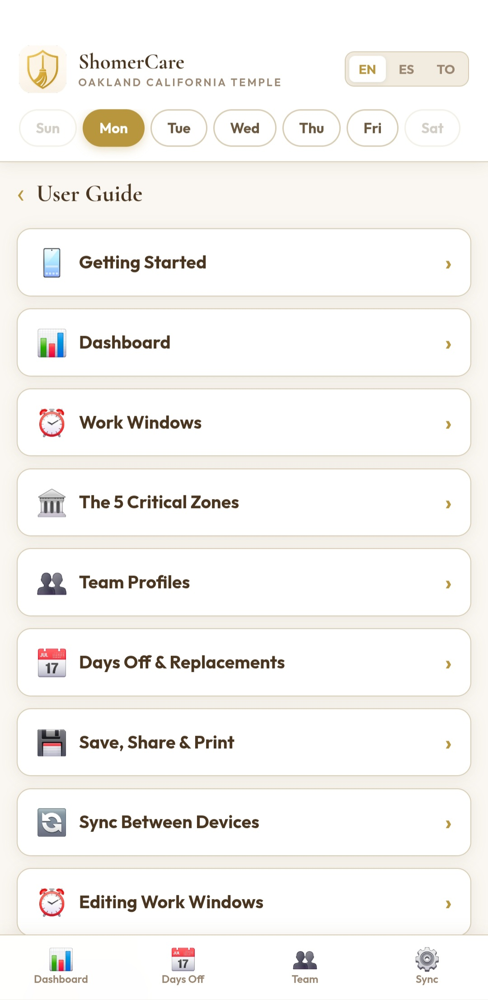
</div>

Built-in accordion tutorial covering every feature — no external docs needed.

---

### 🖨️ Print

- Weekly schedule print view with org branding
- Day-by-day breakdown by zone and window
- Color-coded team legend and supervisor timestamp in footer

---

## Getting Started

**No installation. No server. No account.**

```bash
# 1. Clone the repo
git clone https://github.com/Victordaz07/shomercare-demo.git

# 2. Open the file in any modern browser
open shomercare-demo.html
# or just double-click the file
```

> ✅ Works on Chrome, Safari, Firefox — mobile and desktop.

### First-time setup
1. Open `shomercare-demo.html` in any modern browser
2. Set a PIN — this protects the data on the device
3. Go to **Settings** → enter your organization name, pick an icon
4. Edit zones and zone groups under **Zone Editor** to match your operation
5. Configure work days and time windows under **Work Schedule**
6. Add your team members under **Team**

### Daily use
1. Open the app — Dashboard shows today's schedule
2. Tap any empty window to assign someone
3. Tap the message icon to send WhatsApp updates to the team
4. Use the day strip at the top to plan ahead for the week

### Sharing between devices

**First transfer (setup):**
- On PC: Settings → Export JSON → save the file
- Send the file via WhatsApp/email to the phone
- On phone: open the same HTML, set PIN, Settings → Import JSON

**Daily sync (after setup):**
- On PC: Settings → Generate Sync QR
- On phone: Settings → Scan QR
- Phone applies only the changes; preserves photos and notes locally

---

## Technical Details

### Architecture

```
shomercare-demo.html     ← entire application (~3,400 lines, ~442KB)
│
├── CSS                  CSS custom properties, responsive layout, animations
├── HTML                 Views, modals, lock screen, nav
└── JavaScript
    ├── Translations     EN / ES / TO dictionary
    ├── Data Layer       localStorage with validation & sanitization
    ├── PIN System       Registration, unlock, change, master key
    ├── Dashboard        Zone rendering, coverage calculation, FAB
    ├── Zone Editor      Custom groups and zones, reorder, icon picker
    ├── Team Profiles    Rich profiles with schedule grid
    ├── Days Off         Date management, replacement suggestions
    ├── Sync             QR generation (inlined), JSON export/import, diff merge
    ├── Print            Weekly schedule builder
    ├── Share            WhatsApp message builder
    └── Guide            In-app tutorial (accordion)
```

- Vanilla JavaScript — no frameworks, no build step
- CSS custom properties for theming
- LocalStorage for persistence
- QRCode library inlined — fully offline, no CDN dependency

### Browser Support

| Browser | Support |
|---|---|
| Chrome, Edge, Brave | ✅ Full — including camera QR scanning |
| Safari (iOS & macOS) | ✅ Full |
| Firefox | ✅ Full |
| Android WebView | ✅ Full |

### Storage Model

| Key | Contents |
|---|---|
| `tc7_settings` | Organization identity, work days, windows, zone groups |
| `tc7_collabs` | Team members |
| `tc7_asgn` | Assignments (keyed by `day_zone_window`) |
| `tc7_daysoff` | Days off by person and date |
| `tc7_notes` | Day notes |
| `tc7_lang` | Selected language |
| `tc7_pin` | PIN hash |

Total storage typically under 100KB per organization.

### Data Sync Formats

**Full JSON** (`type: 'full'`):
```json
{
  "v": 7,
  "type": "full",
  "ts": "2026-06-03T12:00:00Z",
  "collabs": [...],
  "asgn": {...},
  "daysoff": {...},
  "dayNotes": {...},
  "covManual": {...},
  "lang": "en",
  "appSettings": {...}
}
```

**Light QR sync** (`type: 'qr_sync'`):
```json
{
  "v": 7,
  "type": "qr_sync",
  "ts": "2026-06-03T12:00:00Z",
  "collabs": [{ "id", "name", "num", "zones", "sched", "type" }],
  "asgn": {...},
  "daysoff": {...},
  "settings": { "templeName", "workDays", "windows" }
}
```

The QR payload is capped at 2,953 bytes (QR Code Version 40, Error Correction M). The app warns if data exceeds this and falls back to full JSON export.

---

## Roadmap

Areas being considered for future iterations:

- Per-zone window overrides (UI exists for the data model; needs an editor)
- Calendar view for monthly planning
- CSV import/export for team data
- Print layouts for individual person schedules
- Multi-day batch assignment
- Notification reminders via the browser's Notification API

---

## Project Status

ShomerCare is in active development by a single developer who uses it personally for custodial operations. It is shared openly for anyone whose operational needs it might fit.

Feedback, suggestions, and feature requests are welcome.

---

## 📁 Repo Structure

```
shomercare-demo/
├── shomercare-demo.html   ← Public demo (generic team, no master key)
├── assets/                ← App icon + screenshots
├── README.md
└── LICENSE
```

> The production version with real team data is maintained in a private repository.

---

## Credits

Built by **Victor Ruiz** — custodian, developer, and BYU Pathway student.

[](https://github.com/Victordaz07)
[](mailto:viruizbc@gmail.com)
[](https://instagram.com/alfonsorb07)
[](https://portarts.dev)

---

## License

This project is shared as-is for use by individuals and organizations who find it useful. No warranty expressed or implied.

---

<div align="center">

**Built with ❤️ and Claude AI · ShomerCare v7 · 2026**

*"Shomer" (שׁוֹמֵר) — Hebrew for Guardian, Protector, Keeper*

⚛️

</div>
